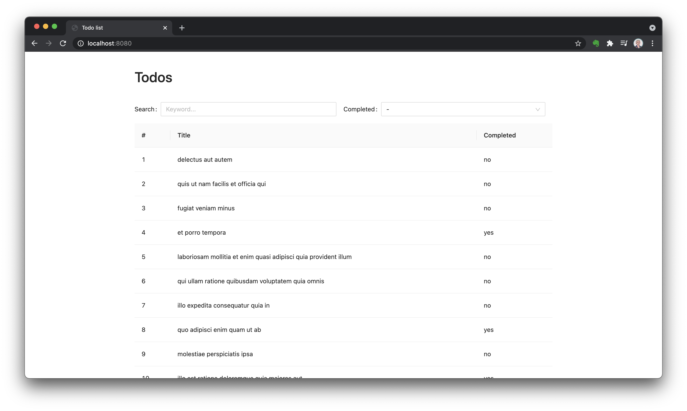
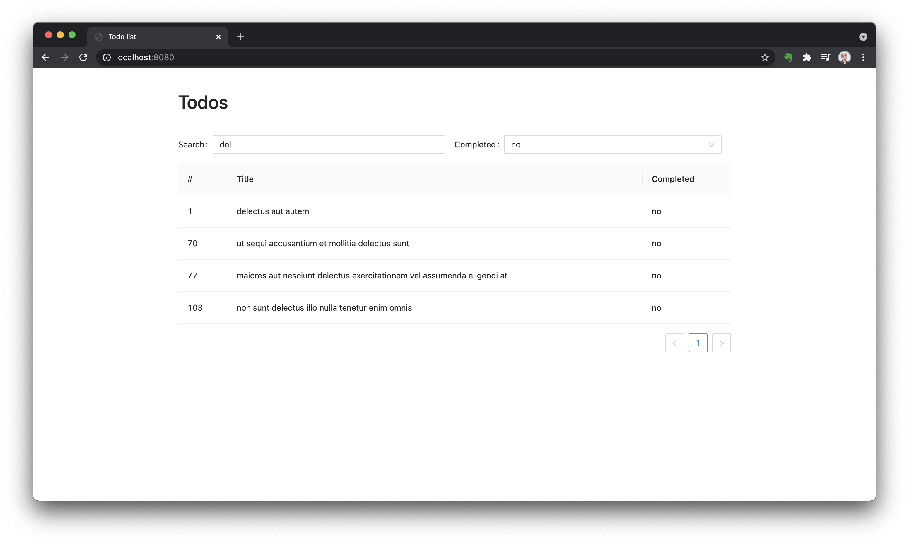
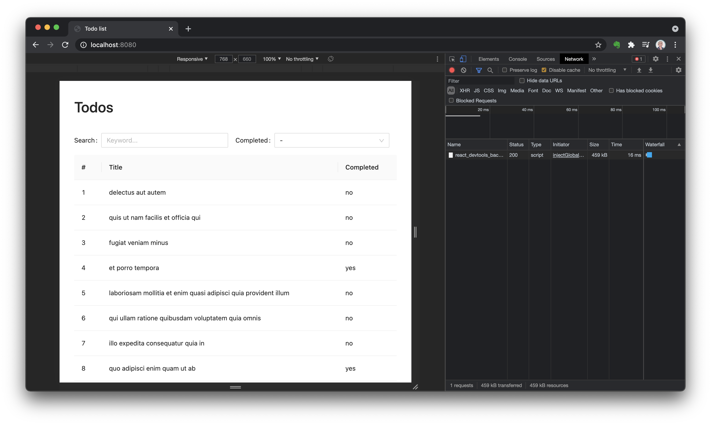
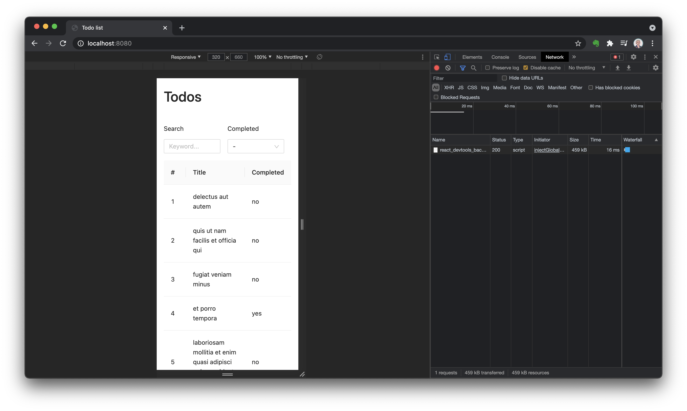
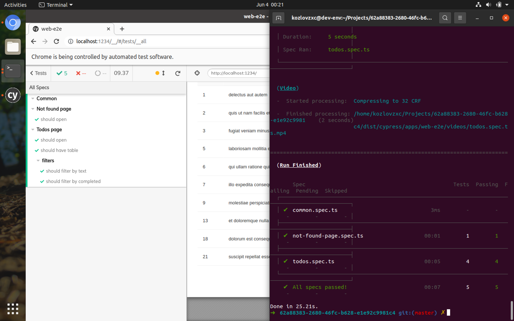
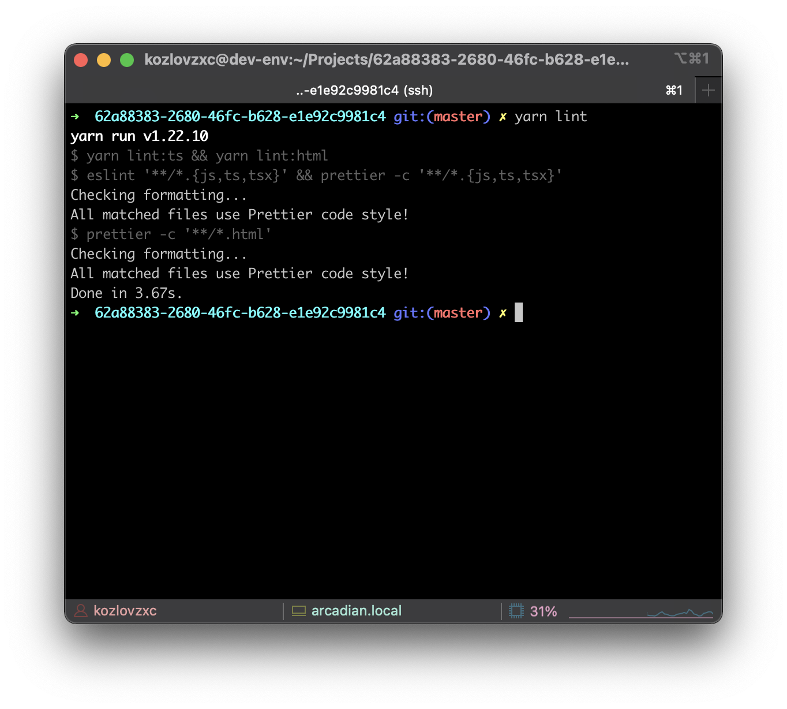

# Major updates

❗️ Note for major changes copared to initial setup:

-   Creact React App -> Parcel.
-   Unit tests -> E2E tests with cypress.

# How to run

1. Install deps.

```bash
yarn
```

2. If you want to run web app -> [apps/web/README.md](./apps/web/README.md)
3. If you want to run web-e2e app -> [apps/web-e2e/README.md](./apps/web-e2e/README.md)

# Screenshots

Desktop


Desktop search example


Tablet


Mobile


E2E tests


Linter checks


# Features

-   Linters

    -   ✅ HTML -> Prettier.
    -   ✅ TS -> eslint (tslint) + Prettier.
    -   ❌ SCSS -> stylelint.

-   Tests.

    -   ✅ E2E tests with cypress for the whole app.
    -   ❌ Unit tests for stores.

-   Apps

    -   Web.
        -   ✅ Initial loader.
        -   ✅ Not found page (not styled).
        -   ✅ Todos table page.
        -   ✅ Publish app to Netlify.
        -   ❌ Fix minification for Parcel
        -   ❌ Change favicon.
        -   ❌ Load only required ant design CSS files.
        -   ❌ Reduce bundle size.
        -   ❓ Add create/update todo functionality (wasn't required).
    -   Web-e2e.
    -   Libs (code shared between different apps).

# Resources

Design drafts -> [figma.com](https://www.figma.com/file/zzkUBJ4ZlzEKrKWZ4KS2Xh/Docler)
Api reference -> [jsonplaceholder.typicode.com](https://jsonplaceholder.typicode.com/guide/)
State management -> [effector.dev](https://effector.dev/)
Components library -> [ant.design](https://ant.design/)
